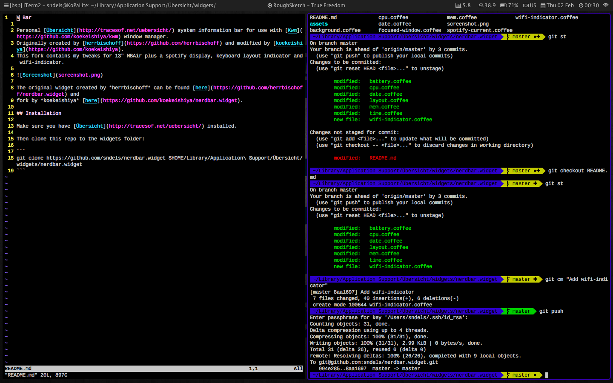

# Bar

Personal [Übersicht](http://tracesof.net/uebersicht/) system information bar for use with [Kwm](https://github.com/koekeishiya/kwm) window manager.
Originally created by [herrbischoff](https://github.com/herrbischoff) and modified by [koekeishiya](https://github.com/koekeishiya).
This fork contains my tweaks for 13" MBAir plus a spotify display and keyboard layout indicator.



The original widget created by *herrbischoff* can be found [here](https://github.com/herrbischoff/nerdbar.widget) and
fork by *koekeishiya* [here](https://github.com/koekeishiya/nerdbar.widget).

## Installation

Make sure you have [Übersicht](http://tracesof.net/uebersicht/) installed.

Then copy the contents of this repo to

```
 $HOME/Library/Application\ Support/Übersicht/widgets/
```
